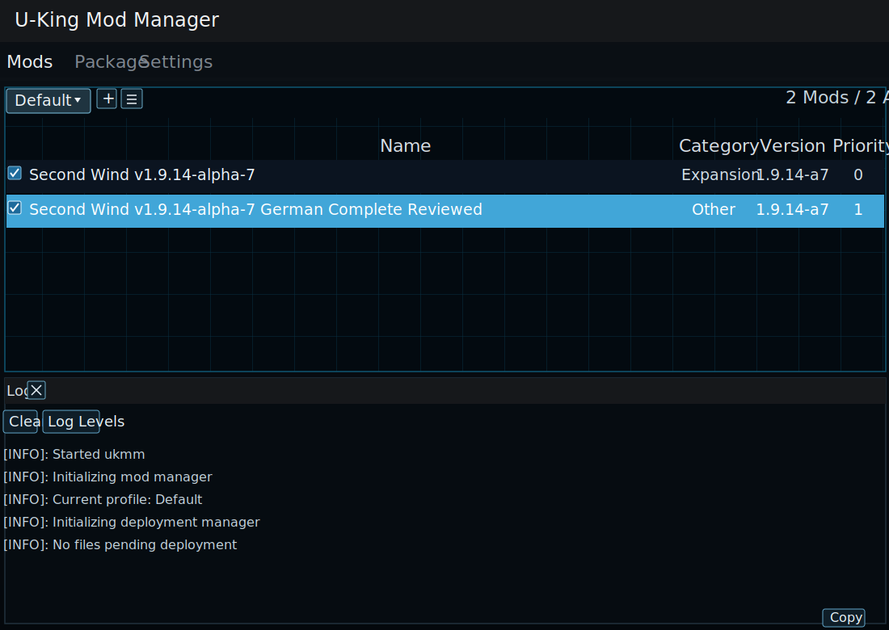

# Breath of the Wild: Second Wind German

Du wolltest schon immer mal die umfangreiche Mod "Second Wind" auf Deutsch spielen? Dann ist dieses Projekt genau das Richtige für Dich! Dieses Projekt befindet sich in der Entwicklung und mit jedem SW-Update wird es einige Zeit dauern, bis die deutsche Version veröffentlicht wird, da nur wenige Personen mithelfen und wir zurzeit NICHT mit dem Second Wind Team in Verbindung stehen.

## Aktueller Stand
Der aktuelle Repository-Stand enthält eine reviewte deutsche Fassung für Second Wind `v1.9.14-alpha-7`.

Die ältere Ablage `Second Wind v1.9.13` bleibt als Referenz erhalten. Der neue Stand liegt unter `Second Wind v1.9.14-alpha-7`.

# Uns Kontaktieren
Du kannst uns auf unserem [Discord Server](https://discord.gg/KbSh6k8e9v) kontaktieren.

[Discord Server jetzt beitreten!](https://discord.gg/KbSh6k8e9v)

# Wie kann ich die Übersetzung verwenden?
## Kurzanleitung mit U-King Mod Manager (UKMM)
Second Wind `v1.9.14-alpha-7` wird in der aktuellen Fassung mit UKMM verwendet. Laut offizieller Release-Beschreibung wird dafuer `UKMM 0.17.0` oder neuer benoetigt.

Unsere BNPs werden nicht fuer Beta-, Dev- oder andere Zwischenbuilds optimiert.

1. Lade die originale Second Wind UKMM-Datei aus den [offiziellen Releases](https://github.com/CEObrainz/Second-Wind/releases). Fuer `v1.9.14-alpha-7` ist das `Second.Wind.v1.9.14-alpha-7-UKMM.zip`.
2. Lade die aktuelle deutsche Patch-Datei aus dem [Release-Bereich dieses Repositories](../../releases/latest). Der finale Patch heisst `SecondWind-v1-9-14-German-Complete-Reviewed.bnp`.
3. Importiere zuerst die Originalmod und danach den deutschen Patch in den U-King Mod Manager.
4. Aktiviere beide Eintraege im Tab `Mods`.
5. Achte darauf, dass der deutsche Patch eine hoehere Prioritaet als die Basis-Mod hat. Im Beispiel unten liegt `Second Wind v1.9.14-alpha-7` auf Prioritaet `0` und der deutsche Patch auf `1`.
6. Wenn UKMM noch Aenderungen anwenden muss, fuehre das Deployment aus. Sobald im Log `No files pending deployment` steht, ist die Konfiguration einsatzbereit.

_Schematische Beispielansicht basierend auf dem aktuellen UKMM-Setup: Die Originalmod ist aktiv, der deutsche Patch ist ebenfalls aktiv und liegt mit hoeherer Prioritaet darueber._

# Wie kann ich dieses Projekt unterstützen?
Du kannst dieses Projekt unterstützen indem du uns Fehler/Übersetzungsfehler im [Issues Tab](https://github.com/customswitch/SecondWindGerman/issues) mitteilst und unserem [Discord Server](https://discord.gg/KbSh6k8e9v) beitrittst.

# Mitwirkende
- [customswitch](https://github.com/customswitch)
- [Ncoord](https://github.com/Ncoord)
- [KoenigYoshi](https://github.com/KoenigYoshi)
- [Second Wind Team](https://discord.com/invite/VU4z9AF)
